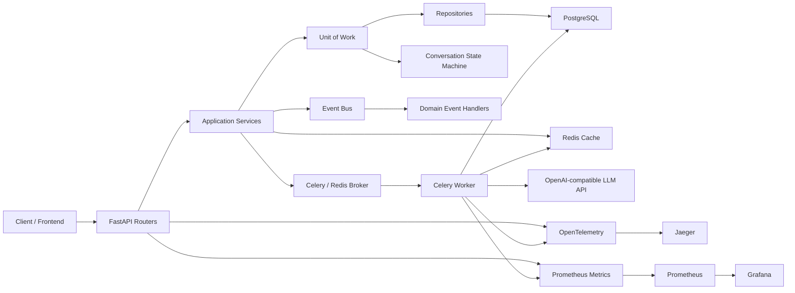
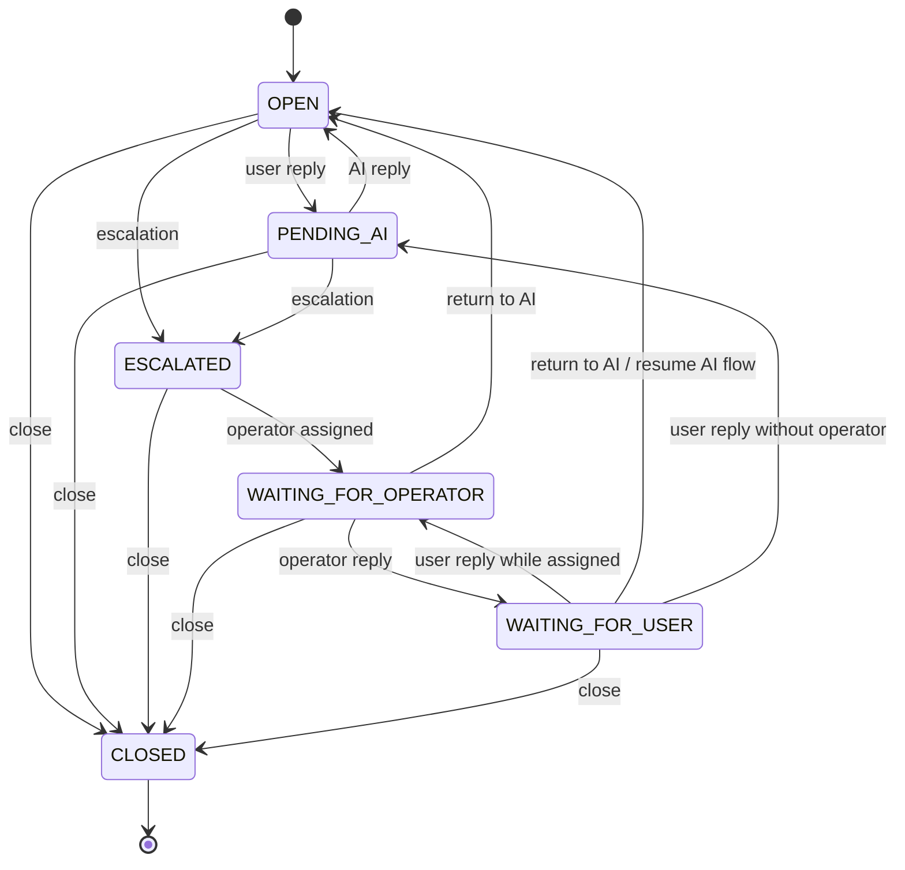
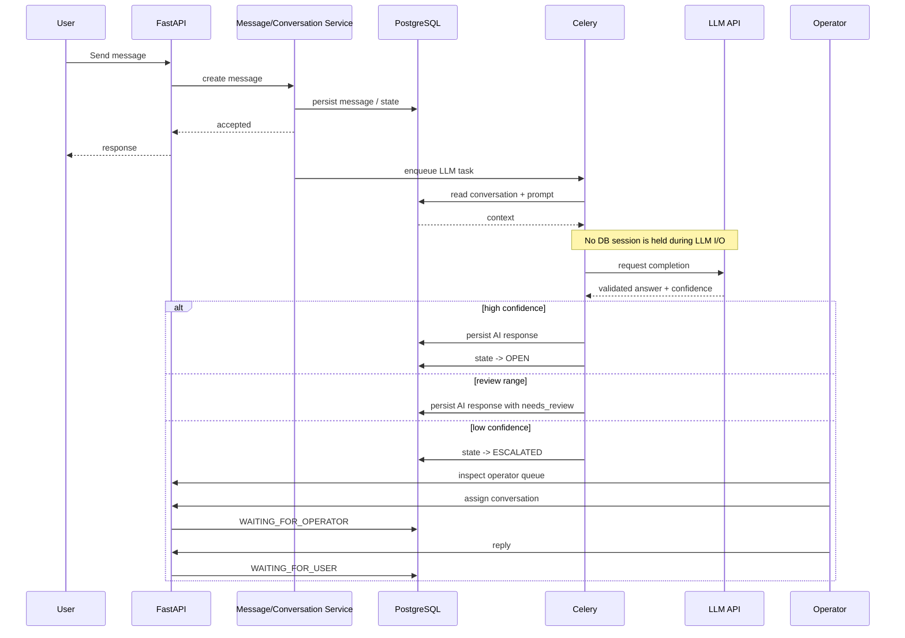
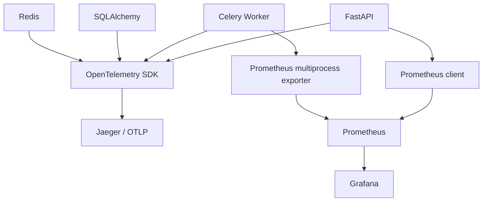
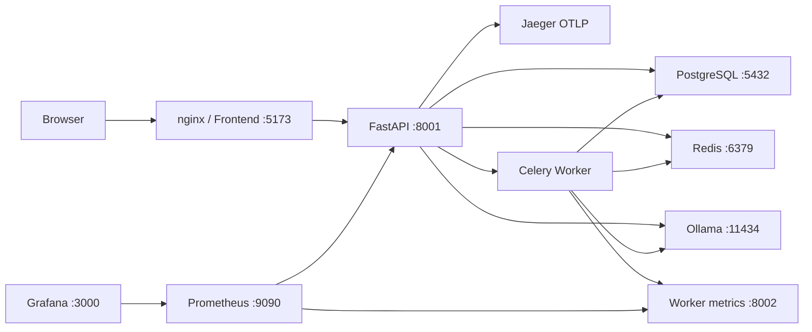

# Architecture

## 1. System overview

AI Support System is a layered asynchronous helpdesk backend.

The HTTP path is deliberately separated from persistence and business logic:

```text
Client
  |
  v
FastAPI Router
  |
  v
Service
  |
  v
Unit of Work
  +--> Repository
  +--> Conversation State Machine
  |
  v
PostgreSQL

Service / domain events
  |
  v
Event Bus
  |
  v
Event handlers / Celery integration
```

Long-running LLM work is performed outside a database transaction:

```text
Message
  |
  v
short DB transaction: persist / schedule
  |
  v
Celery
  |
  +--> short DB read transaction
  |
  +--> LLM API call
  |
  +--> short DB write transaction
```

This prevents an external LLM network wait from occupying a PostgreSQL connection.

## 2. Component diagram



## 3. Layer responsibilities

### Routers

Routers are HTTP adapters. They:

- parse path/query/body data;
- enforce authentication and role requirements;
- call application services;
- translate service/domain outcomes into HTTP responses.

Routers should not contain persistence workflows or direct transaction orchestration.

### Services

Services contain application/business operations such as:

- user registration/authentication;
- conversation creation and retrieval;
- message creation;
- operator assignment;
- escalation;
- closing and return-to-AI operations.

Services receive a Unit of Work and infrastructure dependencies such as cache.

### Unit of Work

`app/core/uow.py` owns a database session and the transaction boundary.

It creates the repositories used by the service layer:

- `UserRepository`
- `MessageRepository`
- `ConversationRepository`
- `ConversationStateMachine`

On successful exit it commits and then publishes queued domain events. On an exception it rolls the transaction back. Event-handler failures are logged without attempting to roll back an already committed transaction.

The key invariant is:

> Repositories perform persistence work; the Unit of Work owns commit/rollback.

### Repositories

Repositories isolate persistence operations from application services.

The conversation state machine lives under the repository layer because it both validates the conversation lifecycle and persists its resulting state/audit information.

### State Machine

`ConversationStateMachine` is the single place that defines allowed conversation status transitions.

Current states:

```text
OPEN
PENDING_AI
ESCALATED
WAITING_FOR_OPERATOR
WAITING_FOR_USER
CLOSED
```

The transition graph is explicit rather than inferred from arbitrary service code.

## 4. State transition diagram



`CLOSED` is terminal in the current state graph.

## 5. Event Bus

The event bus provides an in-process publish/subscribe abstraction for domain events.

```text
Service
  |
  +--> mutate aggregate through UoW
  |
  +--> uow.add_event(DomainEvent)
  |
  v
UoW commit
  |
  v
EventBus.publish_async()
  |
  +--> registered handlers
```

Events are published after a successful database commit. This ordering avoids publishing an event for a transaction that subsequently rolls back.

The event bus supports both synchronous and asynchronous handlers.

It is intentionally an in-process mechanism; it is not a distributed Kafka-style event log.

## 6. User -> AI -> escalation -> operator flow



## 7. AI processing and transaction boundaries

The current Celery implementation deliberately uses two DB phases.

### Phase 1: read

- create an engine/session factory for the task;
- open a Unit of Work;
- verify the conversation is still `PENDING_AI`;
- load prompt/history;
- close the Unit of Work.

### External phase

- call the LLM;
- validate the response;
- record LLM latency;
- no SQLAlchemy session is held during this wait.

### Phase 2: write

- open a fresh Unit of Work;
- persist an AI response or escalate;
- commit;
- publish post-commit events;
- close the session.

The current implementation also disposes the task-local engine at task completion. This is an explicit implementation detail and a future optimization point for worker-level engine/pool lifecycle.

## 8. Data model

Core entities include:

- `User`: identity, credentials, role and active operator workload.
- `Conversation`: owner, operator, status, priority, channel, AI confidence and timestamps.
- `Message`: conversation messages and sender metadata.
- `ConversationOperatorLink`: operator assignment history.
- `AuditLog`: state/action history.

Conversation indexes support common filtering by status/priority, user and operator.

## 9. Caching and Redis

Redis is used for:

- conversation cache;
- refresh-token related state;
- Celery broker;
- Celery result backend;
- runtime queue metrics.

Cache is an optimization layer. PostgreSQL remains the source of truth for persisted conversation state.

## 10. Observability architecture



### Tracing

OpenTelemetry is configured with:

- service name;
- OTLP endpoint;
- development environment metadata;
- FastAPI instrumentation;
- SQLAlchemy/Redis/HTTPX/Celery instrumentation dependencies;
- explicit Celery task spans.

Jaeger receives OTLP traffic on port 4317/4318 and exposes the UI on port 16686.

### Metrics

The application exposes:

- HTTP request totals and duration;
- conversation/message/escalation counters;
- LLM latency;
- active conversations;
- Celery queue length;
- dependency availability;
- Celery task totals and duration;
- operator assignment and conversation lifecycle counters.

The Celery worker uses Prometheus multiprocess collection and exposes port 8002 internally.

### Logging

Logging is configured centrally through `app.core.logging`. Correlation IDs are propagated through the application and Celery task entry point so asynchronous work can be related back to the originating request.

## 11. Health checks

`GET /health` checks:

- API process;
- PostgreSQL;
- Redis;
- Celery worker;
- LLM API;
- available disk space;
- number of non-closed conversations.

The endpoint returns `healthy` only when all checks are `ok`; otherwise it reports `degraded` together with individual dependency states.

Docker's `web` healthcheck calls this endpoint.

## 12. Architectural invariants

When changing the system, preserve these invariants:

1. Business rules belong in services/domain abstractions, not routers.
2. Repositories do not own the global transaction lifecycle.
3. Unit of Work owns commit/rollback and post-commit event publication.
4. Conversation status changes go through `ConversationStateMachine`.
5. External LLM I/O must not hold a DB transaction open.
6. PostgreSQL is the source of truth for persistent conversation state.
7. Event handlers must not be able to silently turn a successful committed transaction into a rollback.
8. Observability code must not change business semantics.
9. Performance/load tests remain separate from the normal unit/E2E CI path.

## 13. Current deployment topology



The Compose file is the authoritative description of this local deployment topology.
